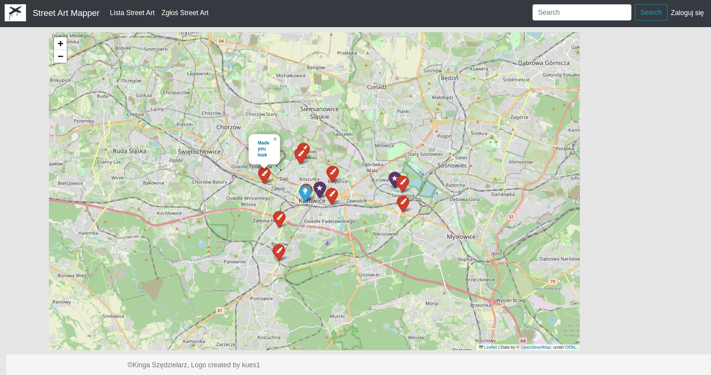
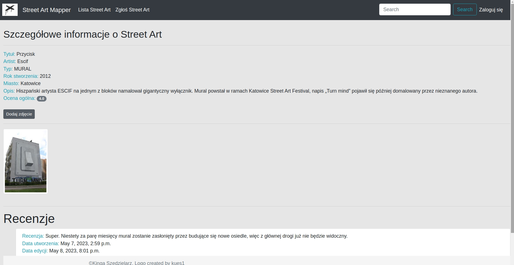
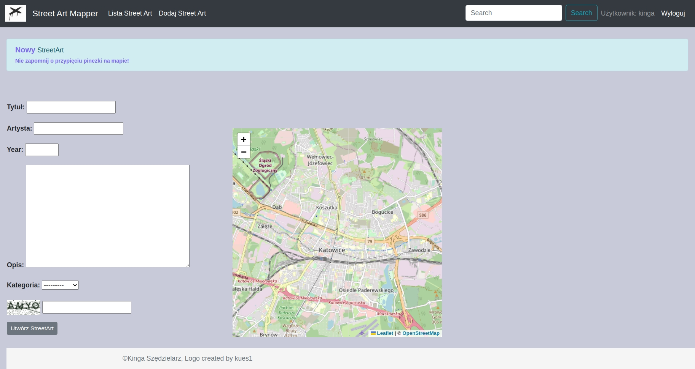

# streetArtMapper
A street art mapping app that uses data from OpenStreetView to display street art locations. 

Users of the app can browse available street art works using an interactive map. 
They can also add new works by providing their location, description and upload photos to enrich the catalog. 
In addition, users can review individual works by leaving comments and ratings, which helps other users decide on their discoveries.

## The implementation used:
Python, Django, PostgreSQL, HTML5, CSS.

## Screenshots

